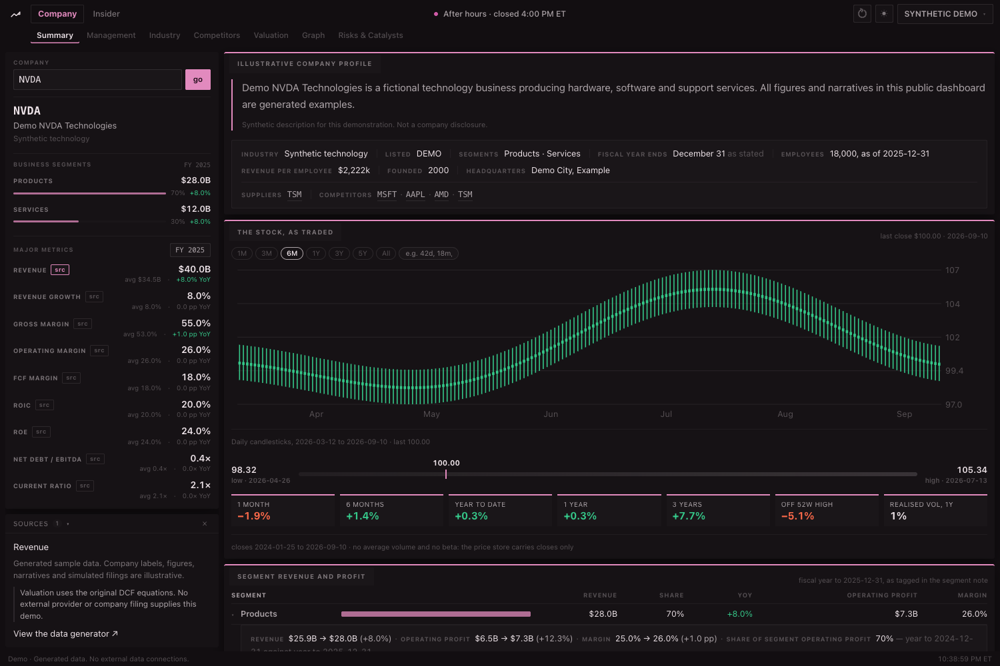

# Company Analyst Dashboard — public demo

**[Open the interactive demo website](https://shaylazheng.github.io/investment-analyst-dashboard-public/)**

[](https://shaylazheng.github.io/investment-analyst-dashboard-public/)

A standalone public edition of the company research dashboard: Summary, Management, Industry, Competitors, Valuation, Graph, Risks & Catalysts, and the Insider screener.

## Run

Node 22.12 or later:

```sh
npm ci
npm run build
npm start
```

Open http://localhost:3778. Use `PORT=3917 npm start` for a different port. `npm run dev` runs the development website.

The hosted site runs entirely in the browser. Generated observations replace every external data connection; no API keys, database, Python service, account or VPN are needed.

## Explore

- Change the company or fiscal year in Summary; inspect generated segments, geographic revenue, financial metrics and stock charts.
- Expand executive profiles in Management and compare the generated industry members.
- Add peers in Competitors, select metrics, inspect sources and open sample insights.
- Adjust discount rate, terminal growth, horizon, dilution and fade in Valuation. The original DCF functions calculate the answer and sensitivity grid.
- Enter NVDA in Graph; inspect counterparties and figures, save a graph locally and open the correlation grid.
- Explore sample risks, catalysts and consensus in Risks & Catalysts.
- Filter Insider by company, trade type, role, date or amount; change sorting, row grouping and page size.

All observations and narratives are synthetic. Familiar tickers are labels for fictional companies, not representations of their actual finances or staff. Returns and correlations are computed from generated prices. Insights are local sample explanations, not AI calls. Refresh reloads the reproducible sample scenario. Browser preferences and saved graphs stay on your device.

**Report is excluded** from navigation, application imports, packages and API routes. The export contains no private history, research datasets, credentials, provider adapters, FRED/WRDS connections, filing ingestion services or notification transports. Public filing excerpts in `packages/core/lib/fixtures` are parser unit-test fixtures only; they do not supply the dashboard.

## Verify

```sh
npm test
npm run test:math
PORT=3917 npm start
# In another terminal, with Google Chrome installed:
npm run test:browser
```

The browser check exercises the eight retained tabs and key controls, checks for browser errors and external requests, and captures the dashboard screenshot. `DEMO_URL` selects another local or hosted URL. `BROWSER_CHANNEL` selects an installed Playwright browser channel.

`demo/data.js` provides generated data to both the local server and the static site's in-browser transport. `npm run build` rebuilds `docs/` for GitHub Pages. Public updates are selective exports; the private workspace is not mirrored.
